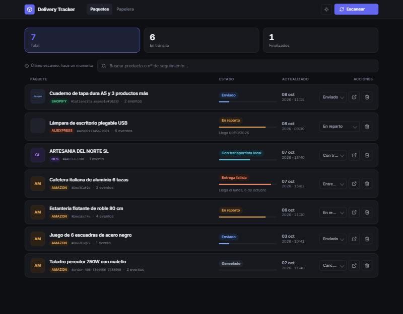
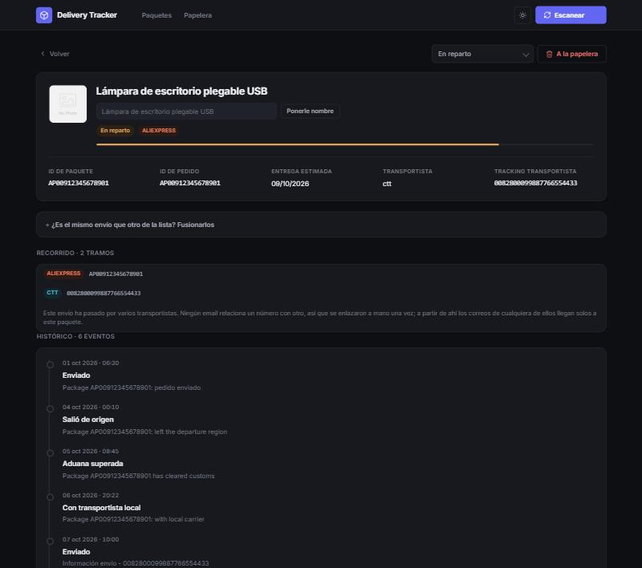
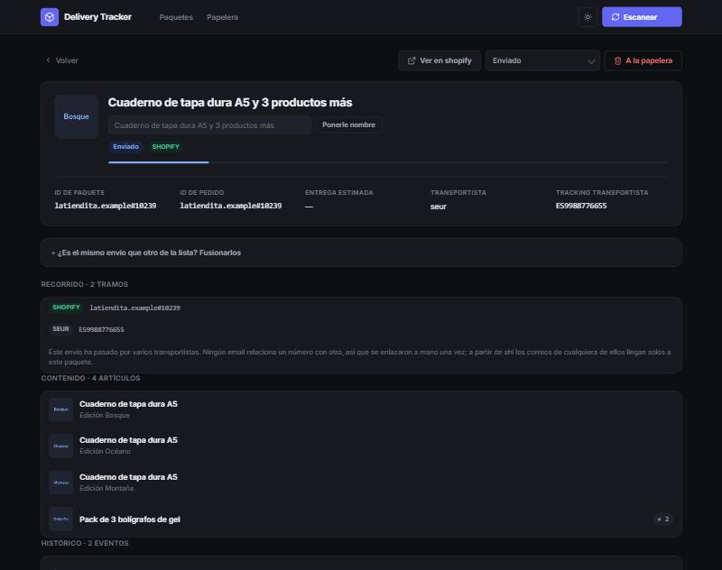

# Delivery Tracker

A self-hosted parcel dashboard that reads your **order and shipping emails** and
turns them into one list of where your stuff actually is.

No tracking-aggregator subscription, no browser extension, no pasting numbers
into five carrier websites. If a shop emailed you about it, it shows up here.



```
Gmail  ──▶  parsers  ──▶  SQLite  ──▶  web panel
                            ▲
              Correos API ──┘   (carriers move daily; shops only email at milestones)
```

Runs as **one container**. Web server, scheduler and database all inside it.

> **Scope, honestly:** this is built for parcels arriving in **Spain**. It reads
> Amazon.es, AliExpress, Shopify, GLS, Correos and CTT Express emails, in Spanish
> and English, and the interface is in Spanish. The architecture is generic —
> parsers are small, independent modules — but out of the box it will not do much
> for a mailbox full of USPS and DHL. See [Adding a source](#adding-a-source).

## Try it in 30 seconds

No Gmail account, no credentials, no setup. An invented mailbox, a throwaway
database in tmpfs, nothing written to disk:

```bash
docker compose -f docker-compose.demo.yml up --build
```

Then open **http://localhost:5001** and press *Escanear*. Every screenshot on
this page comes from that demo.

---

## What it does

**Reads the emails you already get.** Order confirmations, shipping notices,
customs updates, delivery attempts. Each one becomes an event on a timeline.

**Follows a parcel across carriers.** An AliExpress order crosses Europe with one
carrier and gets handed to another for the last mile. Each leg has its own
number, and **no email mentions the other**: the shop never names the carrier,
the carrier never names the shop. You link them once; from then on, emails from
either leg find the parcel by themselves.



**Asks the carrier when email is not enough.** A shop emails you three times:
confirmed, shipped, delivered. The carrier moves the parcel every day. For
Correos shipments the panel queries their public API directly, so the status is
current rather than four days stale.

**Shows what is actually in the box.** Where the email lists the order, you get
every item with its variant, quantity and picture. The variant is not decoration:
three of these four lines are the same product and nothing else tells them apart.



**Stays usable when it does not know something.** Some emails never name the
product. Rather than a blank row or a routing code, it falls back to the tracking
number — and there is a pencil next to every title so you can call it whatever
you want.

**Never loses a parcel to a template change.** Emails from a known sender that no
parser can read land on a *Sin reconocer* page instead of being dropped. That
page is how a broken parser gets noticed, and it cleans itself up: once a parser
learns to read something, its warning disappears. A screen that always shows
seven stale alerts is a screen nobody reads.

### In the panel

- Status pipeline per parcel, with a progress bar and full event history
- Per-shipment titles — a two-item order shipped in two boxes shows two names
- Manual status override that beats anything emails or carriers say
- Rename anything; search across titles, tracking numbers and sources
- Drag anywhere to select, `Supr` to bin, `Ctrl+A`, `Esc`
- Soft delete — everything is recoverable, and the bin empties itself on a timer
- Optional MQTT publishing for Home Assistant (off by default)

---

## Supported sources

| Source | Recognised by | Gives |
|---|---|---|
| **Amazon.es** | sender | status, product, image, ETA, multi-order emails |
| **AliExpress** | sender | status, product, image, grouped "N packages" emails |
| **Shopify** | **email body** | order, items, variants, carrier, order-status link |
| **Correos** | sender + **public API** | live carrier events |
| **CTT Express** | sender | last-mile status, delivery date, shop reference |
| **GLS** | sender | status, links to existing parcels |

Shopify is the odd one. Shopify does not send those emails — every shop sends
them from its own domain, so there is no sender to match. It is identified by the
structure of Shopify's stock notification template, with a cheap subject filter
first to decide whether the body is even worth fetching.

That filter is deliberately loose, so plenty of non-Shopify mail reaches the
parser and gets rejected by the body check. Those count as *irrelevant*, not
*unparsed* — otherwise the "sin reconocer" page fills with noise and stops being
useful.

---

## Running it for real

You need Docker, a Google account, and about ten minutes.

### 1. Gmail API access

1. In [Google Cloud Console](https://console.cloud.google.com/), create a project
2. Enable the **Gmail API**
3. Create an **OAuth client ID** of type *Desktop app*
4. Download the JSON as `data/credentials.json`
5. **Publish the app** (OAuth consent screen → *Publish app*)

> Step 5 is not optional in practice. While the app is in *Testing*, Google
> expires the refresh token after **7 days** and syncing stops dead. The panel
> shows a banner when that happens, but you will be re-authorising every week
> until you publish.

The app only ever requests `gmail.readonly`.

### 2. Configure and run

```bash
cp .env.example .env
python -c "import secrets; print(secrets.token_hex(32))"   # FLASK_SECRET_KEY
```

```bash
docker compose run --rm -p 8080:8080 deliver-tracker python -m scripts.gmail_auth
docker compose up -d --build
```

The panel is at **http://localhost:5000**. The first scan looks back 30 days.

Development mode is the default via `docker-compose.override.yml`: Flask with
auto-reload, code mounted from the host, worker off, and `USE_MOCK_GMAIL=true` so
you can work against sample emails without touching a real mailbox.

### 3. Deploying to a server

A PowerShell script for Unraid, with no registry in the middle:

```powershell
.\deploy\deploy-unraid.ps1 -UnraidHost 192.168.1.10
```

It builds for `linux/amd64`, `docker save`s the image, copies it over SSH, loads
it and brings the stack up. It **never overwrites a remote `docker-compose.yml`**
— that is where your secrets live. Copy `credentials.json` and `token.json` to
the appdata directory and `chmod 600` them; the container drops privileges to
`PUID`/`PGID`.

For anything else, `deploy/docker-compose.unraid.yml` is a normal compose file.

---

## Configuration

Everything is environment variables; `.env.example` has the full list.

| Variable | Default | What it does |
|---|---|---|
| `PANEL_USER` / `PANEL_PASSWORD` | `admin` / *empty* | HTTP Basic auth. **Empty means no auth at all.** |
| `FLASK_SECRET_KEY` | — | Signs the session cookie. Generate your own. |
| `DB_PATH` | `/data/packages.db` | SQLite file |
| `SYNC_INTERVAL_MINUTES` | `60` | How often to scan |
| `GMAIL_FIRST_SCAN_DAYS` | `30` | Lookback on a fresh database |
| `CORREOS_API_ENABLED` | `true` | The only outbound call. Turn it off and nothing else changes. |
| `PURGE_DELIVERED_AFTER_DAYS` | `30` | Archive delivered parcels to the bin (`0` disables) |
| `PURGE_TRASH_AFTER_DAYS` | `30` | Empty the bin for good (`0` keeps forever) |
| `BACKUP_ENABLED` / `BACKUP_KEEP` | `true` / `7` | Daily `VACUUM INTO` snapshots |
| `POSTAL_CODE` | — | GLS asks for it by hand; the panel reminds you |
| `MQTT_ENABLED` | `false` | Home Assistant discovery |
| `DEMO_MODE` | `false` | Invented mailbox, no Gmail |

Between the two purge settings you decide how much purchase history survives.
With the defaults, 60 days from delivery.

---

## Security

Read this before putting it anywhere but your own LAN.

**It ships with no authentication.** `PANEL_PASSWORD` is empty by default, so
anyone who can reach the port can delete your parcels. Set it — or, if you
already have an auth proxy, make sure the container port is not reachable
around it.

**Do not expose it to the internet.** HTTP Basic over plain HTTP sends the
password in the clear on every request. Behind a reverse proxy with TLS it is
defensible; on a public IP it is not.

**The panel can display bearer credentials.** Shopify's order-status link
contains tokens that grant access to the order without logging in. It is stored
so the tracking button works, kept out of logs and out of the JSON API — but it
is rendered as a link on the page. Treat the panel as sensitive.

**Your database is your purchase history.** Backups are plain SQLite files.

Already handled: CSRF on every state-changing request, constant-time password
comparison, Jinja autoescaping with no `|safe` anywhere, parameterised SQL only,
no user input in redirects, read-only Gmail scope, non-root container, secrets
excluded from the image via `.dockerignore`. Dependencies are pinned and checked
with `pip-audit`.

---

## Development

```bash
python -m venv .venv && .venv/Scripts/pip install -r requirements-dev.txt
python -m pytest
```

**524 tests**, more test code than application code. That ratio is deliberate:
almost every test here exists because something broke in a real mailbox. They are
named after the failure, in prose, so a future reader knows what the test is
defending against and not merely what it asserts.

```
app/
  parsers/        one module per source, independent and small
  gmail_sync.py   orchestration: query, dispatch, ingest
  sync.py         persistence, status rules, merging, tracking numbers
  correos_api.py  the only outbound network call
  models.py       SQLAlchemy models + additive migrations
  web.py          Flask app
  demo_data.py    the invented mailbox behind DEMO_MODE
```

Four rules the whole thing leans on:

**Status only moves forward.** A late or duplicate email cannot rewind a
delivered parcel. Cancellation is the exception — a different ending, not a step
back — and a manual override beats everything.

**Dedupe by message id, and re-enrich on rescan.** Re-reading an email never
creates a duplicate event, but it *does* fill in fields the parser has since
learned to extract. Without that, parcels stored before an improvement would stay
incomplete forever, because the raw email body is not kept.

**Deleting leaves a tombstone.** Hard-deleting a parcel drops the message ids
that stop an email being reprocessed, so the parcel would come back on the next
scan. Only the id is kept — no subject, no sender, no content.

**Never merge on a guess.** Two parcels are merged automatically only when they
share a tracking number, which identifies a shipment. Never by name or date:
ordering something, cancelling it and ordering it again leaves two legitimate
parcels with identical names, and merging does not undo. Where the app suspects a
link, it points at it and lets you decide.

### Adding a source

Write a module in `app/parsers/` exposing `matches(sender)` and `parse(...)`
returning a normalised dict, then register it in `gmail_sync.py`. Look at
`gls.py` for the simple case and `shopify.py` for one that has to recognise
itself from the body.

Write the tests against a real email. Every parser here got something wrong the
first time precisely because it was written against an idealised template.

---

## Limitations

- **Spain-centric.** See the note at the top.
- **Only Correos has live tracking.** Others either lack a usable public API, or
  sign their requests, or want a subscription. GLS has no deep link at all — the
  panel copies the number to your clipboard and reminds you of your postcode,
  because their tracker demands both by hand.
- **An email-based tracker cannot know more than the emails.** Where a carrier
  API fills the gap, it is used. Where there is none, the panel moves at the
  speed the shop writes to you.
- **Linking carriers needs one click from you.** When two legs share no data at
  all, guessing would be worse than asking.
- **Single user, single mailbox.** SQLite, one gunicorn worker, no accounts.

## License

MIT — see [LICENSE](LICENSE).
